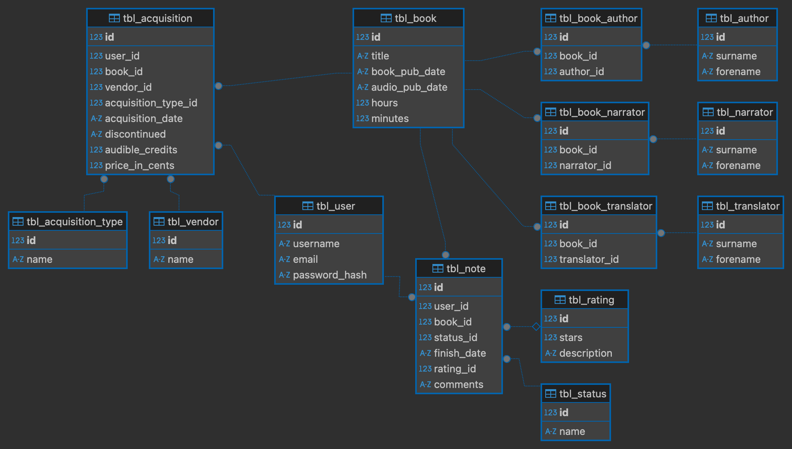

# audiobooks

## Introduction

This is a simple Python CGI application for tracking the audiobooks I've read.
I am constrained to use CGI because my shared hosting server supports only PHP
or CGI and not WSGI.

This is a work in progress.

## Configuration

The code is written for Python 3.10.x because that is the version available
on my shared hosting server.

Set up a virtual environment using either venv or virtualenv and install the
python-dotenv package.

Put the location of the SQLite database into a `.env` file in the application's
root directory. For example:

```config
SQLITE3_DB=data/audiobooks.sqlite3
```

## Installation

To be documented.

## Utility Scripts

### Create Database

```shell
python3 create_db.py \
    --db_file       data/audiobooks.sqlite3 \
    --log_file      logs/create_db.log \
    --log_level     debug \
    --transaction   commit
```

### Create User

```shell
python3 create_user.py \
    --user          username \
    --email         username@example.com \
    --password      "correct horse battery staple" \
    --db_file       data/audiobooks.sqlite3 \
    --log_file      logs/create_user.log \
    --log_level     debug \
    --transaction   commit
```

### Load Example Data

Load the example data for books obtained from audible.com.

```shell
python3 save_audible_data.py \
    --user          user \
    --password      "correct horse battery staple" \
    --csv_file      data/audible.csv \
    --db_file       data/audiobooks.sqlite3 \
    --log_file      logs/save_audible_data.log \
    --log_level     debug \
    --transaction   commit
```

Load the example data for books obtained from cloudLibrary.

```shell
python3 save_cloudlibrary_data.py \
    --user          user \
    --csv_file      data/cloudlibrary.csv \
    --db_file       data/audiobooks.sqlite3 \
    --log_file      logs/save_cloudlibrary_data.log \
    --log_level     debug \
    --transaction   commit
```

## Database

The SQLite3 database was created using SQLite3 3.49.1.

### Entity Relationship Diagram



### SQLite3 CLI

Use the `sqlite3` command line interface to explore the database.

```shell
$ sqlite3 data/audiobooks.sqlite3
SQLite version 3.49.1 2025-02-18 13:38:58
Enter ".help" for usage hints.
sqlite> pragma foreign_keys=ON;
sqlite> .mode column
sqlite> select id, username, email from tbl_user;
id  username  email
--  --------  --------------------
1   username  username@example.com
sqlite> .schema
CREATE TABLE tbl_user
        (
            id INTEGER PRIMARY KEY,
            username TEXT NOT NULL UNIQUE,
            email TEXT NOT NULL,
            password_hash TEXT NOT NULL
        ) strict
    ;
CREATE TABLE tbl_author
        (
            id INTEGER PRIMARY KEY,
            name TEXT NOT NULL UNIQUE
        ) strict
    ;
[remaining output omitted]
sqlite> .quit
$
```
